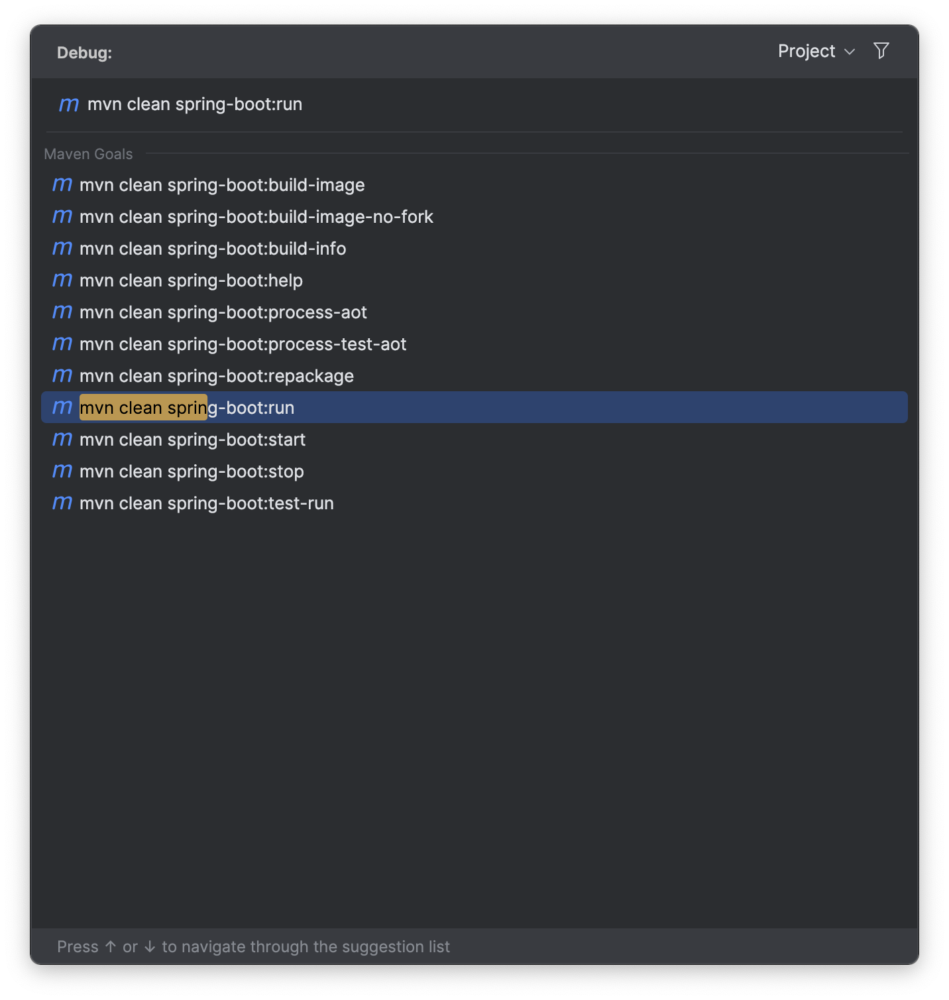
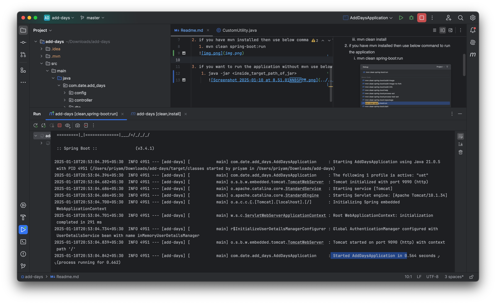
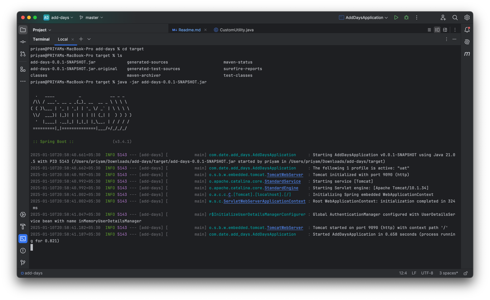
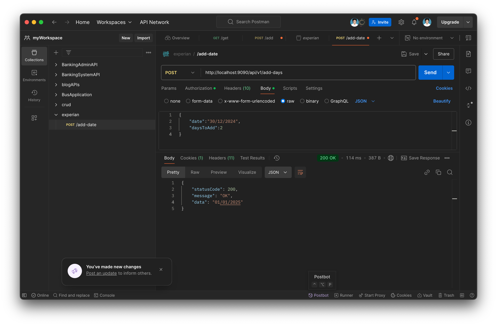

**steps to build and run the application**
1. take the pull and build the application using below command
   1. git clone -b master https://github.com/priyamanand77/experian.git
   2. cd experian
   3. mvn clean install
   
2. if you have mvn installed then use below command to run the application 
   1. mvn clean spring-boot:run
   

3. if you want to run the application without mvn use below command :
    1. java -jar <inside_target_path_of_jar>
   

4. Use the postman collection to access the API for adding a number to a date
   